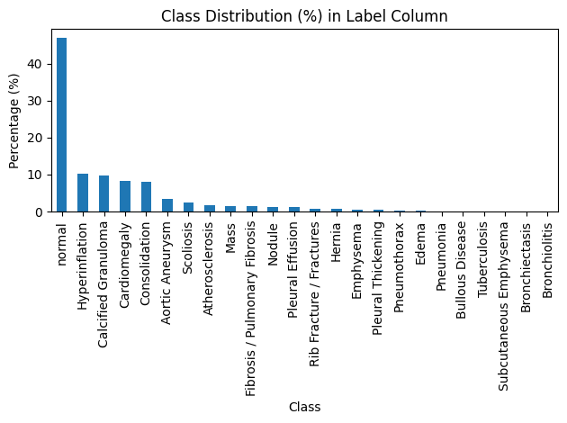

# Clinical Chest X-ray Report Dataset

## Overview

This dataset is a **clinical chest X-ray radiology report corpus** designed for **medical text classification**, **radiology report understanding**, and **clinical NLP research**.  
Each entry corresponds to a **single patient study**, containing both structured and unstructured clinical text extracted from chest X-ray reports.

The `label` column represents the **final disease class** assigned to each report and serves as the ground-truth target for supervised learning tasks.

This repository includes a **deep learning system for automated chest X-ray analysis using BiomedCLIP**, capable of detecting 24 thoracic pathologies with **96.76% accuracy**.

---

## Dataset Characteristics

- **Modality:** Chest X-ray (PA / Lateral)
- **Data Type:** Clinical radiology text
- **Task Type:** Multi-class classification 
- **Total Classes:** 24
- **Domain:** Medical imaging, radiology, pulmonary and cardiovascular diseases
- **Total Images:** 7,466 valid images (14GB)
- **Total Reports:** 3,852 radiology reports
- **Class Imbalance Ratio:** 476:1

---

## Disease Class Labels (24 Classes)

1. Normal  
2. Hyperinflation  
3. Calcified Granuloma  
4. Cardiomegaly  
5. Consolidation  
6. Aortic Aneurysm  
7. Scoliosis  
8. Atherosclerosis  
9. Mass  
10. Fibrosis / Pulmonary Fibrosis  
11. Nodule  
12. Pleural Effusion  
13. Rib Fracture / Fractures  
14. Hernia  
15. Emphysema  
16. Pleural Thickening  
17. Pneumothorax  
18. Edema  
19. Pneumonia  
20. Bullous Disease  
21. Tuberculosis  
22. Subcutaneous Emphysema  
23. Bronchiectasis  
24. Bronchiolitis  

---

## Class-wise Distribution

The dataset shows a **class imbalance**, with a small number of frequent classes and many rare disease categories.

| Class                         | Count | Percentage |
| ----------------------------- | ----: | ---------: |
| Normal                        | 1808 | **46.95%** |
| Hyperinflation                |  398 | 10.33% |
| Calcified Granuloma           |  377 | 9.79% |
| Cardiomegaly                  |  321 | 8.34% |
| Consolidation                 |  312 | 8.10% |
| Aortic Aneurysm               |  133 | 3.45% |
| Scoliosis                     |   92 | 2.39% |
| Atherosclerosis               |   65 | 1.69% |
| Mass                          |   56 | 1.45% |
| Fibrosis / Pulmonary Fibrosis |   56 | 1.45% |
| Nodule                        |   47 | 1.22% |
| Pleural Effusion              |   45 | 1.17% |
| Rib Fracture / Fractures      |   33 | 0.86% |
| Hernia                        |   31 | 0.80% |
| Emphysema                     |   22 | 0.57% |
| Pleural Thickening            |   15 | 0.39% |
| Pneumothorax                  |   14 | 0.36% |
| Edema                         |   11 | 0.29% |
| Pneumonia                     |    4 | 0.10% |
| Bullous Disease               |    4 | 0.10% |
| Tuberculosis                  |    4 | 0.10% |
| Subcutaneous Emphysema        |    1 | 0.03% |
| Bronchiectasis                |    1 | 0.03% |
| Bronchiolitis                 |    1 | 0.03% |

<p align="center">
  
</p>


 
**Observations:**
- Clear **long-tail distribution**
- Several clinically significant conditions have **<1% representation**
- Suitable for research on **imbalanced learning**, **few-shot learning**, and **robust medical NLP models**

---

## Data Schema

Each row represents **one patient study** and contains the following fields:

| Column | Description |
|------|-------------|
| `uid` | Unique identifier for each radiology report |
| `image` | Type of imaging study (e.g., Chest X-ray PA / Lateral) |
| `indication` | Clinical reason for the scan |
| `comparison` | Reference to prior imaging studies (if available) |
| `findings` | Detailed radiologist observations |
| `impression` | Final diagnostic summary |
| `MeSH` | Structured medical terms (disease, location, severity) |
| `label` | Final disease class used for model training |

---


## Model Performance

| Metric | Value |
|--------|-------|
| **Test Accuracy** | 96.76% |
| **Test AUC** | 77.19% |
| **Best Model** | epoch_search_e100_fold3.pth |

**Top Conditions Detected:**
- Bronchiectasis (99.8% AUC)
- Bullous Disease (96.6% AUC)
- Edema (91.9% AUC)
- Pleural Effusion (88.2% AUC)
- Cardiomegaly (86.6% AUC)

### Overall Metrics

| Set | Accuracy | AUC | F1 | mAP |
|-----|----------|-----|-----|-----|
| Train | 96.83% | 85.62% | 16.14% | 28.72% |
| Test | 96.76% | 77.19% | 11.22% | 19.38% |

### Epoch Search Results

| Epochs | Mean AUC | Std |
|--------|----------|-----|
| 30 | 0.7295 | 0.027 |
| 50 | 0.7515 | 0.020 |
| 70 | 0.7593 | 0.012 |
| 90 | 0.7605 | 0.016 |
| **100** ✓ | **0.7676** | **0.017** |

**Performance Notes:**
- Low F1 scores on some classes expected due to extreme imbalance
- Some classes have <10 test samples
- Check evaluation results for per-class metrics

---

## Architecture


BiomedCLIP (Frozen, 150M params) ,ViT-Base Vision Encoder (768-dim embeddings) , Classification Head (3 layers, 580K params) 24 output classes


**Key Features:**
- Pre-trained on 15M biomedical image-text pairs
- Focal Loss (α=0.25, γ=2.0) handles class imbalance
- 5-fold cross-validation with automated epoch search
- 80/20 train-test split

**Model Size:**
- Frozen backbone: 150M parameters
- Trainable head: 580K parameters
- Checkpoint: 752MB

---

## Training

### Two-Phase Pipeline

**Phase 1: Epoch Search**
- Tests [30, 50, 70, 90, 100] epochs
- 5-fold cross-validation per configuration
- Selects optimal: **100 epochs** (0.7676 AUC ± 0.017)

**Phase 2: Final Evaluation**
- Best checkpoint: Fold 3, 100 epochs
- Held-out test set: 1,494 images
- Comprehensive metrics + visualizations

### Training Options

```bash
python Xray.py \
    --mode train \              # train | evaluate | both
    --csv_dir archive \
    --image_dir archive/files \
    --batch_size 16 \           # Reduce to 8 if OOM
    --num_workers 8 \
    --lr 2e-5
```

**Hyperparameters:**
- Optimizer: AdamW (lr=2e-5, weight_decay=1e-4)
- Scheduler: ReduceLROnPlateau (factor=0.5, patience=3)
- Loss: Focal Loss (α=0.25, γ=2.0)
- Early stopping: patience=5
- Gradient clipping: max_norm=1.0

**Training Time (on GPU):**
- Single epoch: ~40 seconds
- Full epoch search: ~8-10 hours
- Inference: ~50-100ms per image

**Data Augmentation:**
- Resize to 224×224
- Random horizontal flip (training)
- Normalization (ImageNet stats)

### Threshold Guidelines

| Threshold | Use Case |
|-----------|----------|
| 0.2 | High sensitivity screening |
| **0.3** | **Recommended default** |
| 0.5 | High confidence only |

---

## Intended Use Cases

- Medical text classification  
- Radiology report understanding and summarization  
- Clinical NLP and language modeling  
- Disease prediction from radiology narratives  
- Medical concept extraction using MeSH terminology
- Automated chest X-ray analysis and pathology detection
- Research on imbalanced learning and few-shot learning in medical imaging

---

## Limitations

- Not approved for clinical use
- Requires validation by medical professionals
- Low F1 scores due to extreme class imbalance
- Some classes have insufficient test samples
- Conservative predictions may miss rare conditions
- Should **not** be used for clinical decision-making or diagnostic deployment without appropriate validation and regulatory approval

---

## Dependencies

```
torch>=2.0.0
torchvision>=0.15.0
numpy>=1.24.0
pandas>=2.0.0
Pillow>=9.5.0
scikit-learn>=1.3.0
tqdm>=4.65.0
transformers>=4.30.0
open-clip-torch>=2.20.0
matplotlib>=3.7.0
seaborn>=0.12.0
```

---

## References

- **BiomedCLIP:** [microsoft/BiomedCLIP-PubMedBERT_256-vit_base_patch16_224](https://huggingface.co/microsoft/BiomedCLIP-PubMedBERT_256-vit_base_patch16_224)
- **Focal Loss:** [Lin et al., 2017](https://arxiv.org/abs/1708.02002)
- **Dataset:** Indiana University Chest X-Ray Collection

---

## Ethical Considerations

This dataset is intended **strictly for research and educational purposes**.  
It must **not** be used for clinical decision-making or diagnostic deployment without appropriate validation and regulatory approval.
