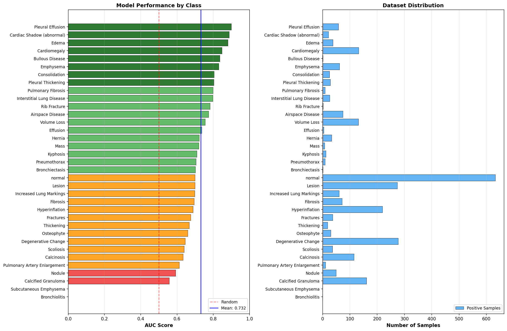
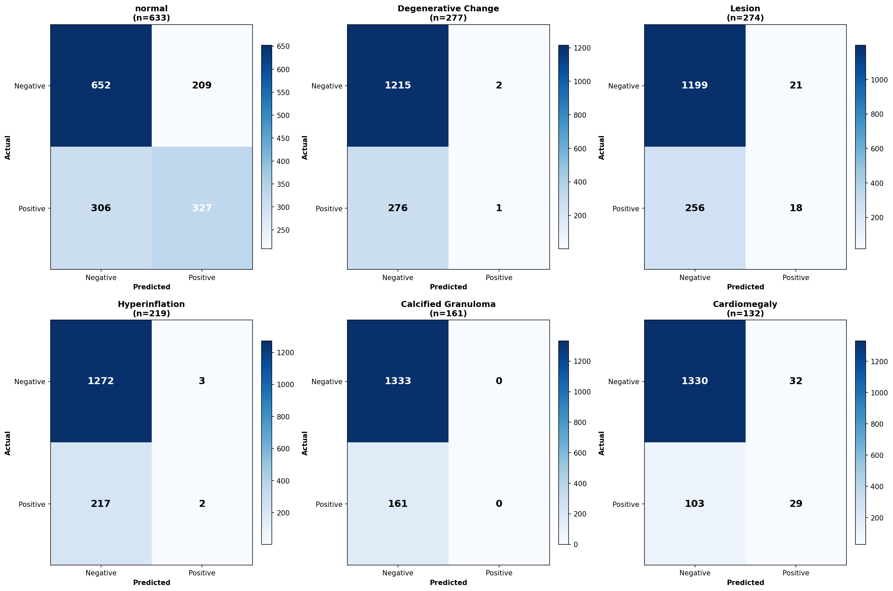
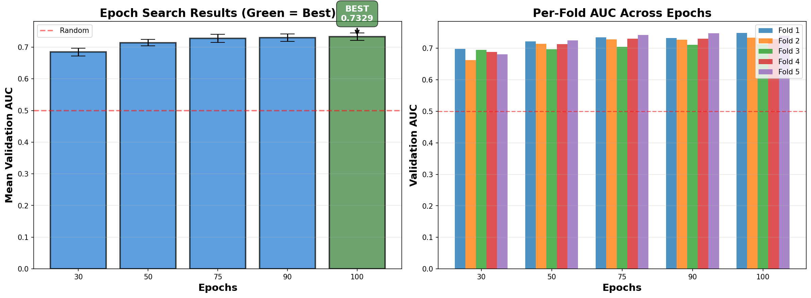

# Clinical Chest X-ray Report

## Overview

This dataset is a **clinical chest X-ray radiology report corpus** designed for **medical image–text understanding**, **radiology report analysis**, and **clinical AI research**.  
The `label` column represents **one or more thoracic disease categories** associated with each study and serves as the ground-truth target for **multi-label supervised learning**.


---

## Dataset Characteristics

- **Modality:** Chest X-ray (PA / Lateral)
- **Data Type:** Clinical radiology reports + corresponding images
- **Task Type:** **Multi-label classification**
- **Total Classes:** 35
- **Total Images:** 7,466 validated X-ray images (~14 GB)
- **Total Reports:** 3,852 radiology reports

---

## Disease Class Labels (35 Classes)

1. Normal
2. Degenerative Change
3. Lesion
4. Hyperinflation
5. Calcified Granuloma
6. Cardiomegaly
7. Volume Loss
8. Calcinosis
9. Airspace Disease
10. Fibrosis
11. Increased Lung Markings
12. Pleural Effusion
13. Emphysema
14. Nodule
15. Edema
16. Scoliosis
17. Fractures
18. Hernia
19. Pleural Thickening
20. Osteophyte
21. Interstitial Lung Disease
22. Consolidation
23. Cardiac Shadow (abnormal)
24. Thickening
25. Kyphosis
26. Pneumothorax
27. Mass
28. Pulmonary Artery Enlargement
29. Pulmonary Fibrosis
30. Effusion
31. Bronchiectasis
32. Bullous Disease
33. Rib Fracture
34. Subcutaneous Emphysema
35. Bronchiolitis

---
---

## Class-wise Distribution

The dataset shows a **class imbalance**, with a small number of frequent classes and many rare disease categories.

| Class                         | Count | Percentage |
| ----------------------------- | ----: | ---------: |
| Normal                        | 3162 | **42.35%** |
| Degenerative Change           | 1360 | 18.22% |
| Lesion                        | 1338 | 17.92% |
| Hyperinflation                | 1076 | 14.41% |
| Calcified Granuloma           |  798 | 10.69% |
| Cardiomegaly                  |  662 | 8.87% |
| Volume Loss                   |  634 | 8.49% |
| Calcinosis                    |  558 | 7.47% |
| Airspace Disease              |  372 | 4.98% |
| Fibrosis                      |  368 | 4.93% |
| Increased Lung Markings       |  305 | 4.09% |
| Pleural Effusion              |  292 | 3.91% |
| Emphysema                     |  286 | 3.83% |
| Nodule                        |  211 | 2.83% |
| Edema                         |  184 | 2.47% |
| Scoliosis                     |  177 | 2.37% |
| Fractures                     |  168 | 2.25% |
| Hernia                        |  155 | 2.08% |
| Pleural Thickening            |  151 | 2.02% |
| Osteophyte                    |  137 | 1.84% |
| Interstitial Lung Disease     |  123 | 1.65% |
| Consolidation                 |  114 | 1.53% |
| Cardiac Shadow (abnormal)     |  105 | 1.41% |
| Thickening                    |  100 | 1.34% |
| Kyphosis                      |   58 | 0.78% |
| Pneumothorax                  |   54 | 0.72% |
| Mass                          |   41 | 0.55% |
| Pulmonary Artery Enlargement  |   36 | 0.48% |
| Pulmonary Fibrosis            |   34 | 0.46% |
| Effusion                      |   26 | 0.35% |
| Bronchiectasis                |   13 | 0.17% |
| Bullous Disease               |    9 | 0.12% |
| Rib Fracture                  |    8 | 0.11% |
| Subcutaneous Emphysema        |    6 | 0.08% |
| Bronchiolitis                 |    2 | 0.03% |


---

---

## Data Schema

Each row represents **one patient study** and contains the following fields:

| Column | Description |
|------|-------------|
| `uid` | Unique identifier for each radiology report |
| `image` | Type of imaging study (e.g., Chest X-ray PA / Lateral) |
| `indication` | Clinical reason for the scan |
| `comparison` | Reference to prior imaging studies (if available) |
| `findings` | Detailed radiologist observations |
| `impression` | Final diagnostic summary |
| `MeSH` | Structured medical terms (disease, location, severity) |
| `label` | Final disease class used for model training |

---
 
**Observations:**
- Clear **long-tail distribution**
- Several clinically significant conditions have **<1% representation**
- Suitable for research on **imbalanced learning**, **few-shot learning**, and **robust medical NLP models**

## Model Performance

<p align="center">
  
</p>

### Overall Test Performance

| Metric | Value |
|------|------|
| **Label-wise Accuracy** | **95.10%** |
| **Mean AUC (macro)** | **73.18%** |
| **Macro F1-score** | 5.47% |
| **mAP** | 14.13% |

### Detailed Metrics

| Set | Label-wise Accuracy | AUC | F1 (Macro) | mAP |
|-----|-------------------|-----|-----------|-----|
| Train | 95.20% | 81.18% | 16.76% | 26.77% |
| Test | 95.10% | 73.18% | 5.47% | 14.13% |

---

### Interpretation of Metrics

<p align="center">
  
</p>


- **Label-wise Accuracy:** Proportion of correctly predicted binary label assignments across all samples and classes.
- **AUC:** Measures ranking quality independent of threshold; preferred metric for imbalanced datasets.
- **F1-score / mAP:** Reflect the model’s ability to correctly identify positive disease labels.

High accuracy values are expected due to the dominance of negative labels per image (average ~1.76 positives out of 35).

---

## Architecture

**BiomedCLIP-based Multi-label Classification Network**

- Vision Encoder: ViT-Base (512-dim embeddings)
- Pretraining: 15M biomedical image–text pairs
- Classification Head: 3-layer MLP (404K parameters)
- Output: 35 sigmoid-activated disease probabilities

**Training Strategy:**
- Partial fine-tuning (last 2 transformer blocks unfrozen)
- Focal Loss (α = 0.25, γ = 2.0) for class imbalance
- 5-fold cross-validation with automated epoch search

**Model Size:**
- Total parameters: **196M**
- Trainable parameters: **404K (0.2%)**
- Frozen parameters: **195.9M (99.8%)**
- Final checkpoint size: **~790 MB**

---


## Training

<p align="center">
  
</p>

### Two-Phase Pipeline

**Phase 1: Epoch Search**
- Tests [30, 50, 75, 90, 100] epochs
- 5-fold cross-validation per configuration
- Selects optimal: **100 epochs** (0.7329 AUC ± 0.012)

**Phase 2: Final Evaluation**
- Best checkpoint: Fold 1, 100 epochs
- Held-out test set: 1,494 images
- Comprehensive metrics + visualizations

**Hyperparameters:**
- Optimizer: AdamW (lr=2e-5, weight_decay=1e-4)
- Scheduler: ReduceLROnPlateau (factor=0.5, patience=3)
- Loss: Focal Loss (α=0.25, γ=2.0)
- Early stopping: patience=5
- Gradient clipping: max_norm=1.0

**Training Time (on GPU):**
- Single epoch: ~40 seconds
- Full epoch search: ~8-10 hours
- Inference: ~50-100ms per image

**Data Augmentation:**
- Resize to 224×224
- Random horizontal flip (training)
- Normalization (ImageNet stats)


## Dependencies

```
torch>=2.0.0
torchvision>=0.15.0
numpy>=1.24.0
pandas>=2.0.0
Pillow>=9.5.0
scikit-learn>=1.3.0
tqdm>=4.65.0
transformers>=4.30.0
open-clip-torch>=2.20.0
matplotlib>=3.7.0
seaborn>=0.12.0
```

---

## References

- **BiomedCLIP:** [microsoft/BiomedCLIP-PubMedBERT_256-vit_base_patch16_224](https://huggingface.co/microsoft/BiomedCLIP-PubMedBERT_256-vit_base_patch16_224)
- **Focal Loss:** [Lin et al., 2017](https://arxiv.org/abs/1708.02002)
- **Dataset:** Indiana University Chest X-Ray Collection

---

## Ethical Considerations

This dataset is intended **strictly for research and educational purposes**.  
It must **not** be used for clinical decision-making or diagnostic deployment without appropriate validation and regulatory approval.

